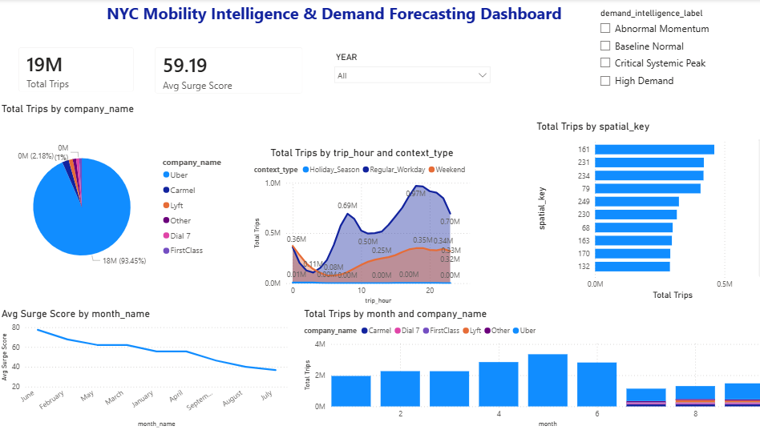
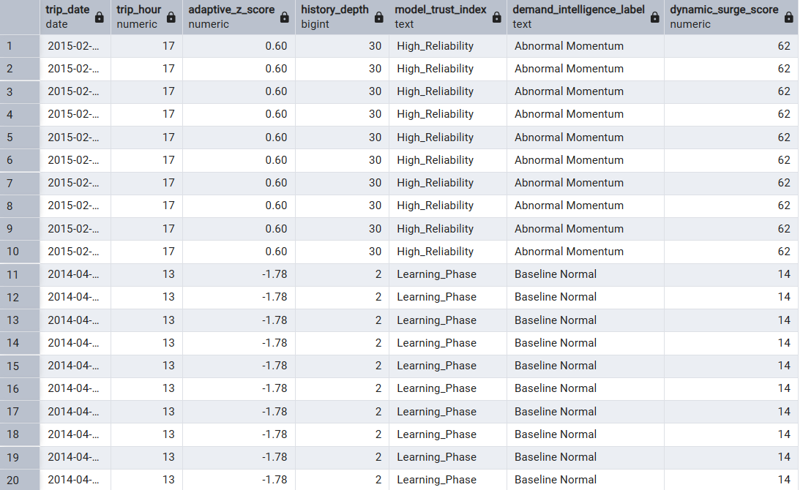
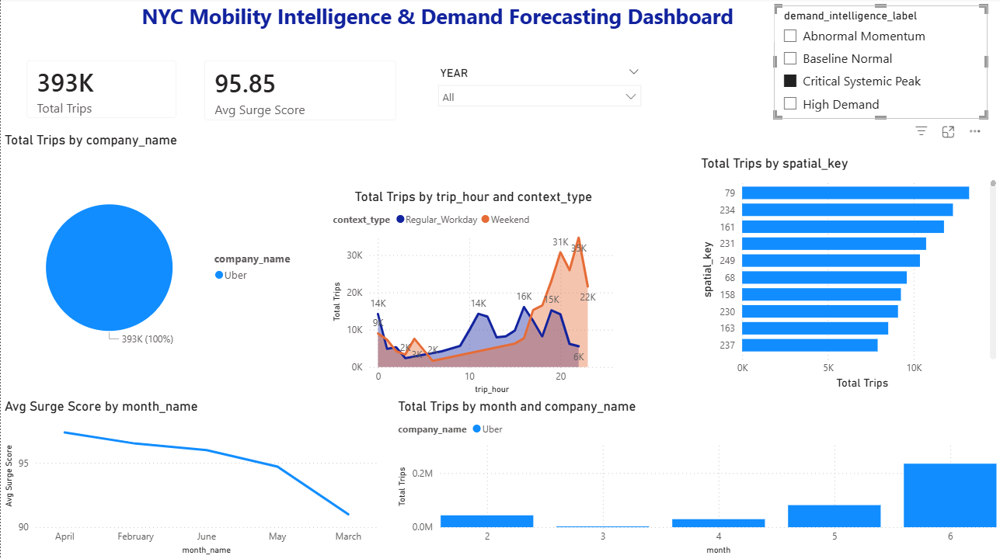

# NYC Ride Intelligence: Adaptive Demand Forecasting & Analytics Engine

A high-performance end-to-end analytics solution transforming **19 Million+ raw trip records** into operational intelligence using a custom SQL-to-Power BI pipeline.

## 📊 Dashboard Overview

## 🎯 Project Objective
This project moves beyond static reporting. It implements a custom **Predictive Analytics Engine** that categorizes market demand into "Intelligence Labels." By comparing real-time volume against historical baselines and recent trends, the system identifies systemic peaks and abnormal market momentum to drive proactive decision-making.

---

## 💼 Business Logic & Operational Impact
The engine is designed to translate complex data engineering into actionable business strategy:

- **Dynamic Supply Allocation:** The 'Critical Systemic Peak' label alerts operations to incentivize driver deployment in specific zones before the system reaches a breaking point.
- **Surge Pricing Foundation:** The 'Dynamic Surge Score (0-100)' provides a data-driven basis for automated surge pricing, identifying when demand outpaces the 30-day moving trend.
- **Competitive Intelligence:** By tracking 'Market Share %' dynamically across 19M records, the business can identify specific 'Context Types' (e.g., Weekends vs. Holidays) where they are losing ground to competitors.

---

## 🛡️ Data Reliability & Sparsity Handling (Governance)
Handling 19 million records across multiple years and providers introduced significant data sparsity. We implemented a robust **Data Governance Layer** within the SQL engine:

- **Model Trust Index:** If historical data for a specific hour/context is < 30 days (`history_depth < 30`), it's labeled as **'Learning Phase'**. It transitions to **'High Reliability'** only with sufficient data.
- **Fallback Logic (COALESCE):** If the 30-day moving average is missing, the engine falls back to the **Global Average** (`COALESCE(moving_avg_30d, global_avg)`).
- **History Depth Tracking:** Ensures transparency in the statistical significance of every alert.

---

## 🧠 The Intelligence Engine: Defining "Demand"
We engineered a multi-layered statistical approach to move beyond raw volume tracking:

### 1. Adaptive Z-Score (The Deviation Metric)
Calculates how much the current hour's volume deviates from the historical global average ($Z \ge 2.0$ indicates significant high demand).

### 2. Trend Divergence % (The Real-time Pulse)
Compares current volume against a **30-day moving average**. A divergence **>25%** triggers an **'Abnormal Momentum'** alert.

---

## 🏗️ Technical Architecture

### Phase 1: Unified Schema & Data Fusion
Harmonized **19 million rows** from disparate providers (Uber, Lyft, Dial 7, Carmel) using SQL `UNION ALL` and sophisticated normalization.

### Phase 2: Feature Engineering & Window Functions
- **Contextual Mapping:** Categorizing trips into 'Holiday_Season', 'Weekend', or 'Regular_Workday'.
- **Dual-Stats Engine:** Leveraged PostgreSQL window functions to process Global Baselines and Short-term Trends simultaneously.

### Phase 3: Spatial Grid Optimization (The "Spatial Key")
To handle visualization latency, we engineered a **Spatial Grid System** ($Lat \times 100$) to create "Binned" keys for high-density analysis without performance loss.

---

## 🛠️ Setup & Implementation
1. **Database:** PostgreSQL.
2. **Processing:** Execute the SQL script to generate the **Materialized View**.
3. **Visualization:** Connect the Power BI template to the processed SQL view.

---

### 📝 Skills Demonstrated:
`Data Engineering` `Business Intelligence` `Data Governance` `Big Data Processing` `Advanced SQL (CTEs, Window Functions)` `Statistical Modeling` `Power BI Dashboards` `DAX`
## 🤝 Connect with Me
**Debbrata Kumar Adhikary** 🔗 **LinkedIn:** [linkedin.com/in/debbrata-adhikary](https://www.linkedin.com/in/debbrata-adhikary/)  
🌐 **Website:** [www.debadhikary.com](http://www.debadhikary.com)  
📧 **Email:** [adhikarydeb111@gmail.com](mailto:adhikarydeb111@gmail.com)
